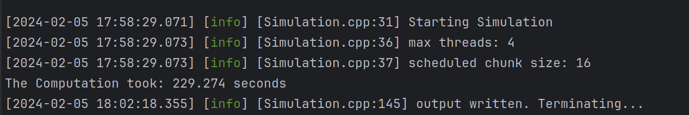
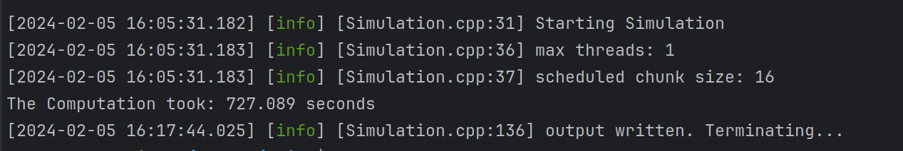
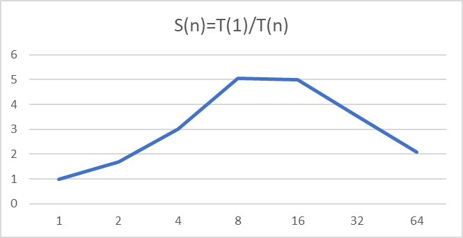
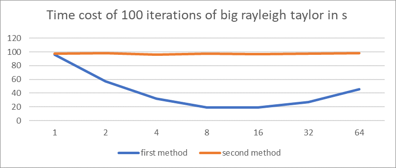
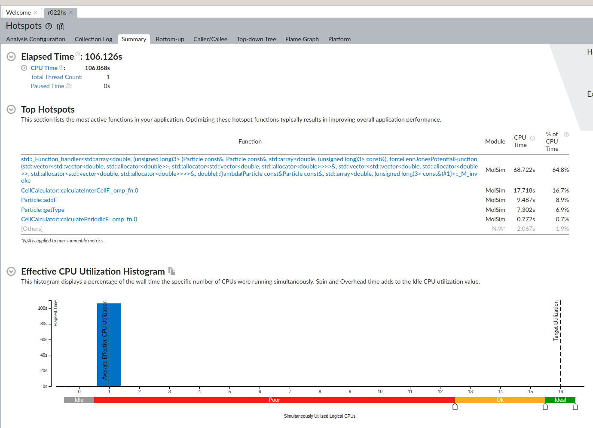

# Group B
## Project Information

**Members:**
Yuchen Zhao,
Grazvydas Kuras,
David Kratz

[Project Link](https://github.com/Grazvy/PSEMolDyn_GroupB/tree/yuchen)
or [Project Link](https://github.com/NanaYCZ/MolSim)

**Last commit:** "Readme done"

**Build/Usage:**
```
mkdir build && cd build
ccmake ..

#for executable
make

#for usage type -h or no arguments, yields:
Usage ./MolSim [-l<String>] [-p] [-o] -f<String>
 Info:              See the /input folder for the parameters.xsd schema, in which 
                    program arguments should be specified
 -f<String>:        gives the filename of an .xml file, that has to follow
                    the xsd schema defined in input/parameters.xsd.
                    from this file all programm arguments / options will be read(see README)
 -l<String>:        specifies the level of logging, e.g. how fine grained programm logs are.
                    can either be "off" "trace", "debug", "info", "error" or "critical".
                    The default level is "debug".
 -h                 prints a help message
 -p                 if the flag is set, the programm will measure the time for the execution.
                    therefore no vtk output and no logging will happen (specifing a log level at
                    the same time is undefined behaviour)

Returns:
                  several .vtu files that can be used for visualisation in Paraview

#for documentation
make doc_doxygen 
```

**Notes:**
Call ./MolSim with no arguments or the -h argument to get a help message about the
command line arguments and what is being returned by the executable. This file should probably be viewed on GitHub, as some media embeddings might not work in e.g. an IDE. Sadly GitHub only allows to upload videos with less than 10 Mb, therefore most of the videos have a mediocre quality and are relatively short.

## Report
### Task 1 Membrane
In parameters.hpp and cpp, allow input of membranes and special forces in XML file. 
The membrane xml should be 
```
<?xml version="1.0" encoding="UTF-8"?>
<parameters xmlns:xsi="http://www.w3.org/2001/XMLSchema-instance"
xsi:noNamespaceSchemaLocation="parameters.xsd">

    <!-- Output Parameters -->
    <outputParameters>
        <baseName>out</baseName>
        <writeFrequency>100</writeFrequency>
    </outputParameters>


    <!-- Simulation Parameters -->
    <simulationParameters>
        <tEnd>500</tEnd>
        <deltaT>0.01</deltaT>
        <cutOffRadius>4.0</cutOffRadius>
        <cellSize>4.0</cellSize>
        <gravityFactor>-0.001</gravityFactor>
        <forceType><Membrane/></forceType>
        <parallelizationVersion>
            <second_method>
                <numThreads>4</numThreads>
            </second_method>
        </parallelizationVersion>
        <boundaryConditions>
            <boundaryConditionsPositiveZ>reflective</boundaryConditionsPositiveZ>
            <boundaryConditionsNegativeZ>reflective</boundaryConditionsNegativeZ>
            <boundaryConditionsPositiveX>outflow</boundaryConditionsPositiveX>
            <boundaryConditionsNegativeX>outflow</boundaryConditionsNegativeX>
            <boundaryConditionsPositiveY>outflow</boundaryConditionsPositiveY>
            <boundaryConditionsNegativeY>outflow</boundaryConditionsNegativeY>
        </boundaryConditions>
        <domainDimensions>
            <x>148</x>
            <y>148</y>
            <z>148</z>
        </domainDimensions>
    </simulationParameters>

    <!-- Membranes -->
    <membranes>
        <position>
            <x>15</x>
            <y>15</y>
            <z>1.5</z>
        </position>
        <velocity>
            <x>0</x>
            <y>0</y>
            <z>0</z>
        </velocity>
        <dimensions>
            <x>50</x>
            <y>50</y>
            <z>1</z>
        </dimensions>
        <mass>1.0</mass>
        <meshWidth>2.2</meshWidth>
        <averageBondLength>2.2</averageBondLength>
        <forceParameter>300</forceParameter>
        <sigma>1.0</sigma>
        <epsilon>1.0</epsilon>
    </membranes>

    <!-- SpecialForces -->
    <SpecialForces>
        <tS>150</tS>
        <f>
            <x>0</x>
            <y>0</y>
            <z>0.8</z>
        </f>
        <position>
            <x>18</x>
            <y>25</y>
            <z>0</z>
        </position>
    </SpecialForces>

    <SpecialForces>
        <tS>150</tS>
        <f>
            <x>0</x>
            <y>0</y>
            <z>0.8</z>
        </f>
        <position>
            <x>18</x>
            <y>24</y>
            <z>0</z>
        </position>
    </SpecialForces>

    <SpecialForces>
        <tS>150</tS>
        <f>
            <x>0</x>
            <y>0</y>
            <z>0.8</z>
        </f>
        <position>
            <x>17</x>
            <y>25</y>
            <z>0</z>
        </position>
    </SpecialForces>

    <SpecialForces>
        <tS>150</tS>
        <f>
            <x>0</x>
            <y>0</y>
            <z>0.8</z>
        </f>
        <position>
            <x>17</x>
            <y>24</y>
            <z>0</z>
        </position>
    </SpecialForces>
</parameters>
```
- Implement membrane generator, which passes extra parameters averageBondLength, forceParameter and position index to the particle parameters. 
- Implement special force generator, which passes three parameters of the special force position, strengh and last time. To set special forces seperate, so that it is also allowed to pass different strength on different locations to the cell container. Whether it succeeds in passing the membranes and special forces can be read through the output messages.
- Implement specialForce calculator in cell calculator, which compares the corresponding particle position index and special force position index and adds the special force.
- Implement harmonic force, which compares the particle position index of each particle pair to determine whether they are neighbors. Add direct neighbor force and diagonal neighbor force accordingly. If not neighbors, compares the distance between the particles and decides whether the force should be ignored due to cutoff and self penetration, remaining only repulsive part of the LJ force. 
- In the end, with the input file above, we could simulate the situation where a membrane lifted up from a plain and falling onto (and bounces on) the plain due to gravity again. 
- The animation is as follows: [membrane_falling.avi](membrane_falling.avi). We can see the procedure of forces being passed through the membrane.

### Task 2 Parallelization
- As for previous tasks, we already make calculations as linear as possible, which allows x, v and f to be calculated simultaneously in each grid and calculate the boundary conditions at the same time, it's hard to implement other improvements based on the original structure other than strategy 1, and after testing, other loops set parallel will cause false behaviors.
- I implemented another (more basic) structure of the whole calculator and apply the parallelization there (https://github.com/NanaYCZ/MolSim/blob/master/src/particleModel/CellCalculator.cpp) However, the input and output is not well merged into that structure so I failed to profile its improvement.
- The main parallelization is done still using strategy 1, but a method 2 which should be sequential in the simulation function for comparison.          
```
#pragma omp parallel if (calculator.parallelization == concurrency_strategy::second_method)
{
#pragma omp master
{
#pragma omp task depend(out:x)
{calculator.calculateX();}
#pragma omp task depend(in:x) depend(out:f)
{calculator.calculateF();}
#pragma omp task depend(in:f)
{calculator.calculateV();}
```
The redundant strategy above even slows down the program by 985%. Running the small rayleigh taylor experiment on AMD Ryzen 7 7735HS with Radeon , with serial strategy it took 67.03s, with method 1 four threads it uses 229.274s and method 2 four threads it takes 727.089s.




However, the big rayleigh experiment can be speed up using parallelization. The speed up rate and time cost of 100 iterations can be shown in the graphs given. 


- From the comparison between small and big rayleigh experiment, we can infer that the inner and inter cells methods are well set but there are defects in the boundary conditions. 
- With Intel VTune Amplifier, the data of serial and 16 threads method 1 parallelization are shown below. The sequential analysis is convincable that the most time is used in function lambda, however the parallel report seems weird.



### Task 2
#### Parallelization
- for our parallelization strategy, we looked for discrete workloads within our code, which was to the most part already the case
for calculateX, calculateV, shiftF, calculateFWithin and calculateInterCellF (thanks to our parallelization plan from previous tasks).
So pretty much everything that increases with the simulation size was dividable for concurrency
- but things where not quite safe yet, we had to make following changes to avoid make everything truly discrete: 
- First, updateCells
was reduced to its original purpose to just move the particle pointers based on the instructions, so the boundary checking was
placed into applyBoundaries, which is used by calculateX every time a particle is detected outside it's previous cell. So now we can
check the boundary condition for the particles in parallel, after separating the sequential updating of the cells. 
- Second, calculateInterCellF
got a glow-up after getting rid of setNextPath as a way of iterating over the paths. We optimised the redundant iteration over patterns, 
so now they are pre-calculated and stored in CellContainer. Then we had to implement a new starting point iterator, which 
is much more structured and allows us now to iterate of all discrete paths for each pattern. 
- Third, calculateInterCellF was
not fully discrete since we implemented the periodic boundaries. The mirroring mapped on a cell index, which may be the starting
point for another path. So we delegated the periodic force calculation into calculatePeriodicF(), using our new starting point
iterator. Now the linked cell algorithm was fully discrete.
- Fourth, since the overall workload was distributed over multiple for loops with discrete tasks, the plan was to smack
a nice "#pragma omp parallel for" in front of all of them. But apparently OpenMP can be quite picky about custom iterators,
so our new iterators had to fulfill a certain structure, which is an implementation of the "+=" and "-" operator, since
"parallel for" doesn't rely on "!=" to run the for loop, and don't even try using std::vectors as attributes :) Also setNextCell()
had to leave as a way to iterate over cells and a new shiny cell iterator was implemented as well.
- So there we are! Everything works in parallel now, next up, we added selection of the strategy and amount of threads via
xml file input, which creates an enum that can turn our #pragma's on/off via if(parallelization == concurrency_strategy::first_method).
If OpenMP doesn't exist, the #pragma's won't do anything, and we only had to disable omp.h specific methods such as omp_set_num_threads()
via #ifdef #endif.
#### The Pros
- our method supports a high amount of threads, even though the improvement plateaus at some point, we still had speedup
until 56 threads
- the amount of locks is minimized to only one, reducing contention, avoiding deadlocks and improving scalability
#### The Cons
- the amount of workloads per path varies, which could lead to imbalance among the threads. But for now we didn't see any significant problems with synchronization or vastly different workloads for the threads, as can be seen in the performance analysis. 

#### further
- some particle distributions can imbalance certain pattern iterations, because it would lead to their paths being very 
filled with particles and others left empty. But this is not a real problem for us, since we have many different directions
and as a result, every inhomogeneous distribution would have a diversified workload (in)balances. Homogeneous distributions
may suffer from the imbalance problem stated in the cons, which why tried to solve, building a sorted starting point
iterator. This iterator was supposed to apply a heuristic to give the longer paths first, resulting in a dynamic distribution,
with workloads getting shorter and shorter with each iteration for the homogeneous distribution. But after the designing
the algorithm/iterator, we decided to drop it in order not to overcomplicate and over-engineer our code.
- looking back, we were wrong about the dynamic cell sizes. We thought that increasing the comparing_depth would allow more
concurrency, since more paths would be available and increased runtime, with the cutoff being applied more precise. But we
were wrong on both, since splitting into more tasks doesn't improve concurrency, if there are already way more tasks than threads.
And applying the cutoff more precise doesn't remove many combinations, if the cutoff is not that big. But the price of 
small cell sizes was high.
- we tried to further improve our code by inlining some small and frequently used methods as well as defining some in a
header file and removing all avoidable while loops, for better compiler optimisation.
- we cleaned up unused code and as already mentioned, rebuild our linked cell algorithm to be more structured and readable.

#### Performance
- We measured and profiled the performance of our parallel version with Intel's Vtune profiler and perf. Measurements were performed within a Linux environment on an AMD Ryzen 7 5700U without VTK output and logging enabled. We used gcc with the optimization level -O3 and for all measurements we used the rayleigh-taylor instability example in 3D (but with tEnd=0.1 only). Measuring the runtime for a different number of threads yields the following:


- It is important to know that the AMD Ryzen 7 5700U only has 16 logical CPU Cores, meaning only 16 threads can run truly parallel. Therefore it is expected, that after more than 16 threads no further speed-up is gained, as there a never more than 16 threads running truely parallel. The graph shows, that more than 16 threads are even a bit slower than the execution of "only" 16 threads, likely because the additional software threads create overhead by context switches etc.
- The linear trend of speed-up only remains until ~ 8 threads, altough already 8 threads don't provide the expected speed-up of 8. For 16 threads it becomes obvious, that the expected speed-up of 16 is not reached. When examining the scenario with 16 threads using Vtune, we get several statistics. The first one shows the how much logical CPU cores run in parallel for how long.


-  The upper diagram results from executing our program with 8 threads and the lower one from executing it with 16 threads. We can see, that in both cases most of the time the program utilizes exactly the specified amount of threads and especially that the threads are mapped to truely parallel logical CPU cores, which is good.
-  The second interesting statistic shows what the different threads are actually doing and when they are waiting.  


- On the upper left side is the program executed with 8 threads, on the upper right side executed with 32 threads and the lower diagram shows the execution with 16 threads (here it should also be possible to see the legend/ description of the diagram). We can see that for 8 and 16 threads, every thread has $\approx$ 100 % CPU utilization, which is in line with the first two bar graph statistics. Then for 32 threads, we can see, that every Thread only has $\approx$ 50 % CPU utilization, as there are only 16 truely parallel hardware threads. Apart from that, we can't really see a reason for the 16 threads not leading to the expected speed-up. Altough there is one short time span, where the threads are spinning/ have overhead due to locks, this is likely an interruption by the OS, as all threads are idle in this time span. Therefore synchronization doesn't seem to be a significant bottleneck for the performance of the execution with 16 threads.
- When looking at the tables of functions and the respective time  spend within them, there doesn't seem to be a clear difference between running the program with 1 thread(left) or running the program with 16 threads(right). Except with 16 threads ~ 6 % more time is spend in `force_exp`, whereas with 1 thread ~ 5 % more time is spend in `calculateInterCellF`. The percentage next to a function f1, represents the time that is spend in the respective function f1 without the time, that is spend in other functions f2, that are called by f1.
`force_exp` is the function for calculating the Lennard-Jones-Potential (not smoothed). In the regular program, we use function lambdas to dynamically switch between different ways of calculating the force, but direct calls to a function known at compile time make profiling a lot easier and the runtime remains basically unchanged.


 - Further insights can be gained when looking at the Code annotated with the time spend in each line next to it. The upper annotations show the execution with 1 thread, the  lower annotations show the execution with 16 threads. It is important to note, that here the percentage next to the line is the total percentage that the program spends in the respective line. This means time that elapsed in a function call from a certain line will be counted towards that line as well.


- It is clearly visible, that for 16 threads the time spend calculating the actual potential is significantly reduced (e.g. time spend in line 168,169 and 179, 181) compared to the execution with one thread, while the time spend accessing memory(e.g. line 161-163) is significantly increased compared to the execution with one thread. As can be seen in the third statistic for the 16 thread execution(function call table), another ~ 10% of total execution is spend in the `addF` function, which is called in `calculateInterCellF` and two other functions (`calculatePeriodicF` and `calculateFWithin`) after the force was calculated between two particles. It just adds a force vector to the force vector of its particle. This time correspond to another ~ 10 % of time spend for accessing memory, as the performed Addition is likely not responsible for this amount of runtime. In total, about 40 % of runtime is spend accessing memory in the execution with 16 threads, which is quite high. In general parallelizing memory-bound programs is difficult and can lead to problems.
- When looking at the cache-miss rate for a different number of threads, it becomes apparent, that the 16 threads underperforming, might  be due to a poor cache-performance. 


- We can see that the cache miss rate is increasing with more threads and that our programm has a high cache-miss rate in both cases. In general and especially with parallelization the program is in parts memory bound. The actual calculation of the forces in the CPU, at least for the Lennard-Jones Potential, does not take the majority of the runtime as it is not too complex (~ 45 % for 1 thread, ~ 30 % for 16 threads). Optimizing the memory access is likely a hard task though. Currently we have a vector of particles to store the particle objects. Then in our Cell Datastructure (`CellContainer`) we only store pointer to those particles, because particles will frequently move from one cell to another and moving pointers is cheaper than moving particle objects. After some timesteps these particle pointers are 'randomly' distributed throughout the grid of cells, because of their physical behaviour. Therefore any iteration over the cells and particle pointers in these cells will access particles at arbitrary points in our vector of particles objects, because the order of particles in our vector of objects can be very different from the order of the particle pointers in the Cells. This will lead to bad cache performance, because we access memory at very different addresses successively. 
- The observed increase in cache misses can have a substantial influence on the performance, because accessing cache data is much faster than retrieving information from the DRAM. This rise in cache misses might be due to false sharing between the threads, meaning the threads invalidate each others local caches(L1 and L2 in most architectures) due to changing data in the same cache line. 

##### Configurations
- For all measurements and statistics we used the rayleigh-taylor instability example in 3D (but with tEnd=0.1 only). The runtime measurements were made by calling our program with the `-p` option and the application was compiled with gcc and `-O3`. The statistics from Vtune were obtained by performing the 'Threading' Analysis from the Intel Vtune tool chain and the application was compiled with `-O2` and `-g` to generate debugging symbols. For the cache-performance  measurements, the program was compiled with the same arguments and executed with `perf stat -e cache-misses,cache-refernces -a ./Molsim ..` .
- We tried a few different compiler flags such as `-Ofast` , `-march=native`, `-malign-data=cacheline` and`-ftree-loop-optimize`, but none of them increased performance significantly. We also tried using AMD's μProf, but it turned out to not be very useful.


### Extra
- As we did not familiarize ourselfes with the Linux Cluster last week, we initaly wanted don't wanted to do performance analysis on it, but because we were really interested to see, what our implementation could do, we did some smaller analysis in the end. First we repeated the runtime measurement for a different number of threads. The executable was compiled with gcc and `-O3`. It was executed on the Linux Cluster cm2_tiny on a computing node with 56 cores. We used the the rayleigh-taylor instability example in 3D (but with tEnd=0.5 only).


- as we can see now we get a significant speed-up, that corresponds to the number of threads until ca. 32 threads. 56 threads do not provide the expected speed-up of 56 similar to the 16 threads not providing a speed-up of 16 on our local machine. 
- as the Linux Cluster seems to be running Intel processors, further  analysis of the program is possible and more statistics are available. The executable was compiled with gcc and `-O3`. We used the rayleigh-taylor instability example in 3D (but with tEnd=0.1 only). The HPC analysis of Intel Vtune suggests, that there is an increases in Pipeline slots, that were blocked due to memory access, meaning the pipeline stalled and could not continue with the execution, as some instructions waited for memory accesses. On the
left is the analysis for 1 thread, on the right for 32 threads. (unfortunately there is no data on how often the pipeline stalled due to DRAM accesses as Hyper Threading is enabled on the Linux Cluster)


- The Threading analysis of VTune executed on the cluster with 32 threads once again showed, that also on the cluster only about 8 % are spend for synchronization, which is similar to the case of 16 threads fairly low.  
- In conclusion, the program is likely memory bound for a high number of threads, as our profiling suggests, that we have little runtime loss due to synchonisation. Optimizing this memory access will be a hard task, as the physical behaviour can lead to almost random distribution of the particles pointers in the Cell datastructure. It would be interesting to see if a second parallelization strategy could somehow avoid the limitations due to memory access. 

### Contest 2
- the 2D simulation without output was performed in 2.05 seconds, with 1000 iterations and 10.000 particles we get 4.88 MMUPS
- the 3D simulation without output was performed in 51.69 seconds, with 1000 iterations and 100.000 particles resulting in 1.93 MMUPS
- down below, you can find the instructions to recreate our measurements


### Task 3 

- Simulating the rayleigh-taylor-instability in 3D and with tEnd=100, we get the video below. This video is only a compressed version, the full version, if of interest, is 'rayleig_taylor_instability_3D.mp4' within this folder. The simulation took about 12 hours on a Laptop with AMD Ryzen 7 5700U and compiled with `-O3`.


https://github.com/Grazvy/PSEMolDyn_GroupB/assets/101070208/2c561c04-c0b9-4cda-bc8f-c7f0fb12f63a


### Task 4

### Task 5 Crystalization of Argon
- For this task we implemented the smoothed Lennard-Jones potential, the function to calculate the diffusion coefficient and the radial distribution function. Then we did several different simulations and analyzed them.
#### Implementation
-  In the XML input file, the user now has to specify the type of force, with which the simulation should run in `forceType`. There is now a optional `RDF` component, that if specified has to contain the interval size i.e. the accuracy of the radial distribution function and the frequency with which the rdf is calculated. A frequency of x means that every x-th iteration, the rdf is calculated. Similarly there is an optional frequency for the calculation of the diffusion coefficient. If no frequency is given for the diffusion coefficient, it will not be calculated. There is also a short documentation of the XML-file format at the end of this Readme file. 
-  In order to choose between different ways of calculating forces, we switched back to using lambda-functions. The CellCalculator has a function variable `force`, which can store an arbitrary function that adheres to the interface of taking two particles and returning a 3d-vector of forces(the real function signature is a bit different tough, as it also takes an offset). Depending on the XML-input, `force` is then either the gravitational, the Lennard-Jones or the smoothed Lennard-Jones function for calculating forces.
-  For the smoothed Lennard-Jones potential it is possible to do a small optimization. There are several different powers of $d_{ij}$ (the distance between the two particles) and $\sigma$, therefore calculating $d_{ij}^6$ and $\sigma^6$ once at the beginning and calculating higher powers like $d_{ij}^{14}$ from these precalculated powers is a useful optimization.
-  We added a `ThermoStats` class, because the `CellCalculator` class contained a lot of different functionalities, due to the incremental structure of the working sheets. Therefore we created the `ThermoStats` class, that contains the function for applying the ThermoStat from last sheet, a function for calculating the current Temperature of the system and all the functions for thermodynamical statistics. This makes the Code more structured as there is not a single class that contains all of the features of the simulation.    
- The diffusion coefficient is part of the `ThermoStats` class and implemented with two functions `initDiffusionCoefficient` and `getDiffusionCoefficient`. The functions rely on a new functionality of the Particle class. The particle class now contains `boundaries_crossed`, an array 3 of int, that is supposed to track in which direction and how often a particle crossed a periodic boundary; for example if a particle crossed a periodic boundary in positive x direction, `boundaries_crossed[0]` is increased by one.
The calculation of the diffusion coefficient every `diffusionStatFrequency`-th iteration (XML parameter) will reset this `boundaries_crossed` after it was used for calculating the diffusion coefficient.`initDiffusionCoefficient` stores the positions of all particles in a list `particle_positions_previous_iteration` of ('pointer to particle x','current position of particle x') pairs. It is called once at the very beginning of the simulation. Then every `diffusionStatFrequency`-th iteration, the `getDiffusionCoefficient` is called. The `getDiffusionCoefficient` function will for every particle retrive the current position of that particle, the position from the previous iteration(`particle_positions_previous_iteration`) and how often and in which direction the particle crossed a periodic boundary(`boundaries_crossed`). From these values the true distance, that the particle traveled since the last iteration is calculated. These distances are summed up over all particles and then divided by the amount of particles. WE made the choice to track the boundaries, that were crossed within the Particle, because it is a simple and effective solution. Whenever the `updateCells` routine moves particles due to periodic boundaries, it is already accessing the Particle, therefore almost no additional cost is needed for doing the appropriate operation on `boundaries_crossed`. This is especially nice in the context of potential parallelization of `updateCells`. An additional datastructure for storing the information would complicate manners; e.g. an additional search for every particle that `updateCells` is processing.   
- The rdf is implemented by dividing the maximal possible distance, that two particle can have, into intervals of a given size. For each interval we then count the number of particle pairs that have a distance in this interval. Then for every Interval, the rdf is calculated according to the formula in the sheet. 

#### Simulation of cooling Argon

- Starting with an equilibrated fluid of Argon at a temperature of 3.0 (simulation temperature), the fluid was cooled until a temperature of 0.5 (simulation temperature). Below is the video of the simulation, the end result we obtained and  the statistics we calculated 


https://github.com/Grazvy/PSEMolDyn_GroupB/assets/101070208/43897fb6-0ffa-488c-8b92-ac7bbbc5afc2


https://github.com/Grazvy/PSEMolDyn_GroupB/assets/101070208/0074efa9-670c-432b-88bf-d59b9a9ed189


- When looking at the simulation and the end result it is possible to see that a certain structure is forming, but it is hard to determine what it exactly looks like. Still it is clear, that the particles are more condensed in the end, which can also be seen from the radial distribution function. The rdf shows, that in the end small distances are far more prevalent, than in the beginning. 
- The diffusion coefficient is linearly decreasing over time. The general trend makes sense, because we are linearly decreasing the temperature as well and with lower temperature of the system, we would expect less movement or activity. In order to somewhat verify the diffusion we also measured the temperature during the simulation and the plots are very similar. This fits due to the temperature being a function of the velocities and the diffusion coefficient being a function of the movement of the particles in the last time step and $v = \frac{ x(t_{current}) - x_(t_{last}) }{\delta t}$. The general behaviour makes sense, but it is hard to spot the phase transitions. The first phase transition of Argon from gaseous to liquid should happen at 87.302 K or 0.7275 and the second from liquid to solid at 83.81 K or 0.6984. From the Temperature plot, we can see that we are crossing both of these Temperatures at time $\approx$ 190. We can observe a sudden change in the potential energy of the system at time $\approx$ 190. Though in the potential energy plot, it is difficult to make a clear distinction between the two phase Transitions, as there is only a $\approx$ 0.03 difference in simulation temperature between the transition from gaseous to liquid and the transition from liquid to sloid. Nevertheless the plot of the potential energy fits the temperature plot and seems to be correct.
- The rdf shows, that with proceeding time and therefore also decreasing temperature, the expected distances of two particle decrease. Expecially distances in the interval 1.3 ~ 1.4 become far more prevalent. Apart from that it is visible, that the distribution function is oscillating more with decreased temperature. These oscillations mean that there a certain distances that are far more prevalent than others. Maybe this is the case, because the crystallized Argon organizes in lattices of face-centered cubics [^1]. Then instead of the equilibrated fluid of the beginning, there is a clear structure, in which the molecules organize. In such a regular repeating grid structure it would make sense, that there are only a few certain distances e.g. the distance to the direct neighbours of the cuboid that occur often, whereas other distances are practically impossible due to the grid structure. In general the rdf seems to fit as the sources we could find show a similar rdf and trend of the rdf for decreasing temperature [^2].    


#### Simulation of super cooling Argon

- Starting with an equlilibrated fluid of Argon at a temperature of 3.0 (simulation temperature), the fluid was super cooled until a temperature of 0.02 (simulation temperature). Below is the video of the simulation, the end result we obtained and then the statistics we calculated.

https://github.com/Grazvy/PSEMolDyn_GroupB/assets/101070208/5d9445db-8bd2-4bb0-961e-f622981e2e9c


https://github.com/Grazvy/PSEMolDyn_GroupB/assets/101070208/e59e897d-79dc-464f-be7f-363602c931f3


- Again it is possible to see a distinct structure forming in the simulation, but it is hard to recognize a certain structure. Again the particles are more condensed at the end.
- The rdf seems to have a similar trend to the rdf of the normal cooling simulation, except that it is oscillating even more strongly. Compared to the rdf at time=10 and the rdf at time=30, which are really smooth functions, the rdf at time=50 and later shows a clear oscillation. Again this might be due to a regular repeating structure forming, altough it is difficult to find information on the structure of Argon in an amorphous glass state.
- The diffusion coefficient and the temperature plot show an intersting behaviour. At a temperature of $\approx$ 0.6 and time $\approx$ 33 the cooling slows down and the slope of the temperature function is less steep then before. This roughly fits the freezing point of Argon, which is at 83.81 K and therefore at $\frac{83.81}{120} \approx 0.698$ (simulation temperature). Looking at the temperature graph, the phase transition from liquid to solid happens at time $\approx$ 31.
- The potential energy again fits the point of the phase transition at $\approx$ 31 from the temperature plot. After this point, we can observe a sharp decline in potential Energy within the system, that  stops at time $\approx$ 50, which is when the system has reach its final temperature of 0.02  (simulation temperature).

  
- In the following we did the simulations from above but made everything a bit bigger, because why not now that we have a super fast parallelized program :)) 

Cooling until Crystalization of Argon:

https://github.com/Grazvy/PSEMolDyn_GroupB/assets/101070208/81474079-02d0-4f4b-8151-14f5bf76170c

- end result:

https://github.com/Grazvy/PSEMolDyn_GroupB/assets/101070208/949404f3-937d-4bdd-b3bd-a65ee17bcbed

- the resulting structure from above is quite interesting and seems to be very regular. First we speculated it might have something to do with the lattices of face-centered cubics, in which Argon arranges when it crystalizes. Since we are on on the level of several hundred of molecules, there is probably some other reason for the structure though.

Super cooling until amorphous glass state of Argon:

https://github.com/Grazvy/PSEMolDyn_GroupB/assets/101070208/cfedcf58-0556-4b97-b69f-92e9356e2cab

- in the above video it is possible to really see the phase transition after roughly one third of the time and how the amorphous glass structure is forming. Also the end result of this glass state looks a lot less regular, than the result of the crystalization. 
- end result:

https://github.com/Grazvy/PSEMolDyn_GroupB/assets/101070208/d8ed8fd5-2579-4ca3-9bbc-f83c3e4fc343


[^1]: https://en.wikipedia.org/wiki/Argon
[^2]: http://rkt.chem.ox.ac.uk/lectures/liqsolns/liquids.html
               
### Recreate Cluster Measurements
follow these steps to recreate the measurements for both simulations

- login to the cluster and clone our repository https://github.com/Grazvy/PSEMolDyn_GroupB.git
- within the cloned project, create a build folder and navigate into it 
- load the modules: cmake, xerces-c and gcc via "module load ..."
- run "cmake .." and "make"
- from the project's input folder, copy and paste cluster_rti.xml and cluster_rti3D.xml into the build folder
- add job script for 2D performance measurement: 
```bash
echo '#!/bin/bash
#SBATCH -J sim_2D
#SBATCH -o ./%x.%j.%N.out
#SBATCH -D ./
#SBATCH --get-user-env
#SBATCH --clusters=cm2_tiny
#SBATCH --partition=cm2_tiny
#SBATCH --nodes=1-1
#SBATCH --cpus-per-task=1
#SBATCH --mail-type=end
#SBATCH --mail-user= ### your mail ###
#SBATCH --export=NONE
#SBATCH --time=00:01:00

module load slurm_setup
module load gcc
export OMP_NUM_THREADS=$SLURM_CPUS_PER_TASK
 
./MolSim -f cluster_rti.xml -p' > sim_2D.cmd
  ```
- add job script for 3D performance measurement:
``` bash
echo '#!/bin/bash
#SBATCH -J sim_3D
#SBATCH -o ./%x.%j.%N.out
#SBATCH -D ./
#SBATCH --get-user-env
#SBATCH --clusters=cm2_tiny
#SBATCH --partition=cm2_tiny
#SBATCH --nodes=1-1
#SBATCH --cpus-per-task=56
#SBATCH --mail-type=end
#SBATCH --mail-user= ### your mail ###   
#SBATCH --export=NONE
#SBATCH --time=00:10:00

module load slurm_setup
module load gcc
export OMP_NUM_THREADS=$SLURM_CPUS_PER_TASK
 
./MolSim -f cluster_rti3D.xml -p' > sim_3D.cmd   
```  
- now you can run a job via "sbatch sim_2/3D.cmd" and see the progress via "squeue --clusters cm2_tiny"   
- when the jobs are done, you can read the measurements in the resulting .out files

### Misc / Overview
#### XML File
- this section provides a brief overview of the XML-file format and what each component means (for the sake of good documenation :D)

`outputParameters`
- `baseName` : the .vtu files that will get created by the program, will be of the format `baseName`_`current_iteration`.vtu
- `writeFrequency`: every `writeFrequency`-th iteration .vtu output will be generated
- `checkpointInputFileName`(optional): if given, checkpointed particles will be read from
                                       the file `checkpointInputFileName`
- `checkpointOutputFileName`(optional): if given, at the end of the simulation every particle will be tracked
                                        and written into the file  `checkpointOutputFileName`

`simulationParameters`
- `tEnd`: end time of the simulation / until when should the system be simulated
- `deltaT`: the step-size, with which the simulation runs
- `cutOffRadius`: the forces between two particles will only be calculated, if they are closer than `cutOffRadius` to each other
- `cellSize`: the domain is divided into equal-sized cells, each cell is a cuboid, where every side has
              the length `cellSize`
- `gravityFactor` (optional): if provided, in every time step a vertical force $m \times g_{grav}$ is applied in
                              y-direction to all particles, where `gravityFactor` = $g_{grav}$.
- `forceType`: this element can either be
   `gravitational` (" \</gravitational> "), then the simple gravitational force will be used for inter-particle forces(cutoff will be applied though)
  `LJ` (" \</LJ> "), then the basic Lennard-Jones potential from worksheet 2 will be used
  `smoothedLJ`(" \<smoothedLJ><r_l>1.9</r_l> \</smoothedLJ> "), then the smoothed Lennard-Jones potential from worksheet 5 will be used (where instead of 1.9 any value can be inserted) . All of these are XML elements and not strings! The solution is a bit hacky, but it is good, because it makes explicit, that only if the force is smoothedLJ, you are required to specify r_l and if the force is not smoothedLJ, you cannot specify r_l.
- `parallelizationVersion`: can either be `serial` (" \</serial> "), `first_method`(" \<first_method> \<numThreads> 16 \</numThreads> \</first_method> ") or `second_method` (" \<second_method> \<numThreads> 16 \</numThreads> \</second_method> "). These are again xml elements and not strings! (reasoning why they are same as in `forceType`). `serial` executes the program with one thread. `first_method` is the first parallelization method (and the one that is actually implemented) and `second_method` is the second parallelization method (which is not implemented). If `first_method` or `second_method` are specified, the number of threads `numThreads`, with which the parallel version computes can optionally be given as well. If `numThreads` is not given, openMP will choose the amount of threads, which in most cases corresponds to the number of logical CPUs of the current machine.
- `Rdf`(optional): If given, the radial distribution function will be calculated and written into a "stat.txt" file in the build directory. For the RDF it is required to specify the `rdfIntervalSize`, which is the granularity of the RDF. Meaning the distances between particles are tracked in buckets of size `rdfIntervalSize` from 0 to 'max distance possible between two particle pairs', where every bucket is an integer counter. The rdf is caclulated every `rdfStatFrequency`-th iteration.
- `diffusionStatFrequency`(optional): If given, the diffusion coefficient is calculated every `diffusionStatFrequency`-th iteration and written into a "stat.txt" file in the build directory.
- `Thermostats`(optional): for further details please see the report of week 4
- `boundaryConditions`: for each direction boundary conditions have to be specified. A boundary condition, can either be "reflective", "outflow" or "periodic". Defining in one direction periodic boundaries on one side and not periodic boundaries on the other side does not make sense and is therefore undefined behaviour
- `domainDimensions`: gives the size of th domain in x direction, y direction and z direction. The resulting domain will be from x: 0 - `domainDimensions`(x) and y: 0 - `domainDimensions`(y)  and z: 0 - `domainDimensions`(z).
After `outputParameters` and `simulationParameters` an arbitrary amount of first cuboids and the spheres can be defined (nothing changed here).


